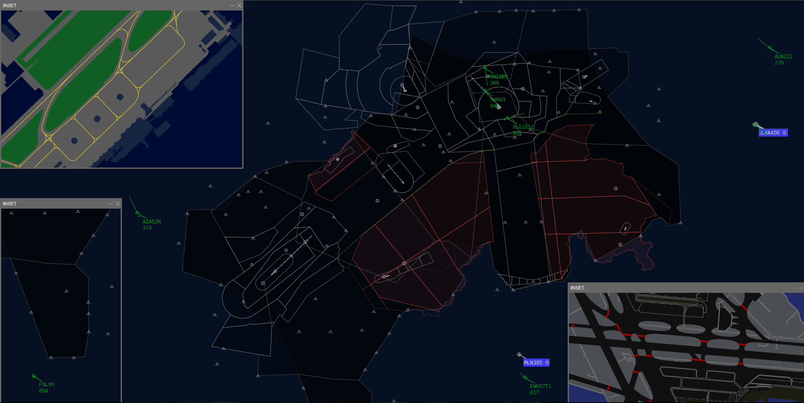

# Welcome to IVAO Switzerland<small> ATC Doc</small>

Do not forget to also view our website [ivao.ch](http://ivao.ch).

## Commands

* `mkdocs new [dir-name]` - Create a new project.
* `mkdocs serve` - Start the live-reloading docs server.
* `mkdocs build` - Build the documentation site.
* `mkdocs help` - Print this help messageeeeeeeeeeeeeeeee.

## Project layout

    mkdocs.yml    # The configuration file.
    docs/
        index.md  # The documentation homepage.
        ...       # Other markdown pages, images and other files.
