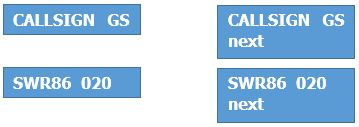
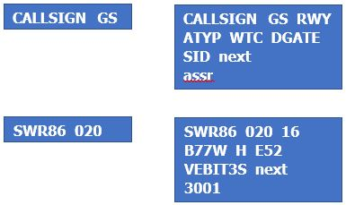
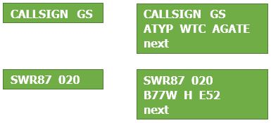

##General knowledge about labels

<u>Extended label:</u> You will notice quite fast that you have more or less information on a label depending if you hover your mouse on it or not. When you move your mouse over the label, it will extend and show more information. This is called the extended label, and corresponds to the right label in this documentation.

##Label definition Switzerland

There is a lot to cover in this part, as IVAC2 offers the possibility to customize the labels until the smallest detail. That's why this part of the documentation is particularly important, so make sure you read it carefully.

In Switzerland we created our labels in order to match the real ones used by Skyguide. There are some small differences, as we had to adapt some functions for IVAO.

<u>What has been customized ?</u>

First of all, the symbols of the track are different depending on different situations (VFR, IFR, concerned, and so on).

Then, you have to know that we have 2 label formats in Switzerland. 

One is for ACC Control, the other for Arrival/Departure Control. 
The Ground labels are common for both definitions, they are composed of following categories:

-	Ground Default

-	Ground Departure traffic

-	Ground Arrival traffic

-	Ground Vehicle

The Airborne labels are composed of following categories:

-	Airborne psr (sqwk SBY)

-	Airborne default (default airborne label)

-	Airborne concerned (label when your sector has been set NEXT)

-	Airborne assumed (assumed label)

-	Airborne filtered (label when filter is active)

-	Airborne released (released label)

We will cover all of them in this document, as the labels we have in IVAC2 have nothing to do with the ones of IVAC1.

##Symbols

The symbols are the easiest part, as there are only 3 different symbols.

 used for VFR traffic or psr traffic (transponder off or on sby)

 used for IFR flights

 used for concerned traffic. That means that if a controller is putting your position as **next**, the symbol will change to this circle. This means that the next controller of this traffic will be you.

##Ground Default

<u>Basic actions:</u>

A left mouse click on the callsign will open the callsign menu

A right mouse click on the callsign will open the FPL

A double click on the callsign will assume or transfer the label to the controller set as “next”.

**The default ground label will be display when the system is not able to define if the traffic is departure or arrival, for example when there is no FPL filled.**

##Ground Departure traffic

<u>Basic actions:</u>

A left mouse click on the callsign will open the callsign menu

A right mouse click on the callsign will open the FPL

A double click on the callsign will assume or transfer the label to the controller set as “next”.

<u>Functions</u>

**RWY**, **SID** and **ASSR** are filled in automatically as soon as you use the DCL Tool (Datalink clearance).

**DGATE** is optional, you can fill it in if you want but it is not mandatory.

**next** has to be set by you if the next controller is online, otherwise the transfer of label will not work. If there is no controller online, you can leave it blank and release the traffic on UNICOM as soon as he is leaving your sector.

**assr** is the assigned transponder, which you entered into the DCL Tool

##Ground Arrival traffic

<u>Basic actions:</u>

A left mouse click on the callsign will open the callsign menu

A right mouse click on the callsign will open the FPL

A double click on the callsign will assume or transfer the label to the controller set as “next”.

<u>Functions</u>

**AGATE** is optional, you can fill it in if you want but it is not mandatory.

**next** has to be set by you if the next ground controller is online, otherwise the transfer of label will not work. If there is no controller online, you can leave it blank and release the traffic on UNICOM when needed.

##Ground Vehicle

Not used in Switzerland for the moment

##Airborne psr

<u>Basic actions:</u>

A left mouse click on the callsign will open the callsign menu

Right mouse click unused

Double click unused

<u>Functions</u>

##Airborne default

<u>Basic actions:</u>

A left mouse click on the callsign 

A right mouse click on the callsign 

A double click on the callsign will assume or transfer the label to the controller set as “next”.

<u>Functions</u>

##Airborne concerned

<u>Basic actions:</u>

A left mouse click on the callsign 

A right mouse click on the callsign 

A double click on the callsign will assume or transfer the label to the controller set as “next”.

<u>Functions</u>

##Airborne assumed

<u>Basic actions:</u>

A left mouse click on the callsign 

A right mouse click on the callsign 

A double click on the callsign will assume or transfer the label to the controller set as “next”.

<u>Functions</u>

##Airborne filtered

<u>Basic actions:</u>

A left mouse click on the callsign 

A right mouse click on the callsign 

A double click on the callsign will assume or transfer the label to the controller set as “next”.

<u>Functions</u>

##Airborne released

<u>Basic actions:</u>

A left mouse click on the callsign 

A right mouse click on the callsign 

A double click on the callsign will assume or transfer the label to the controller set as “next”.

<u>Functions</u>
